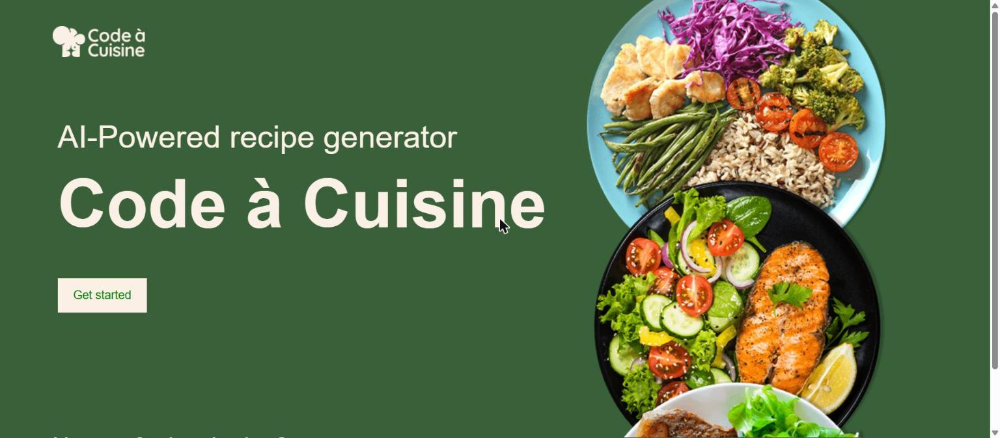
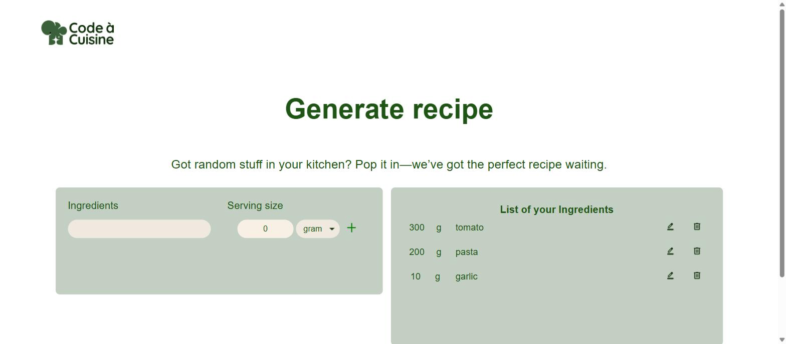
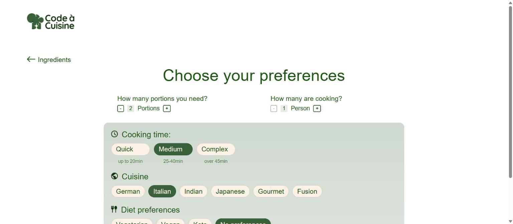
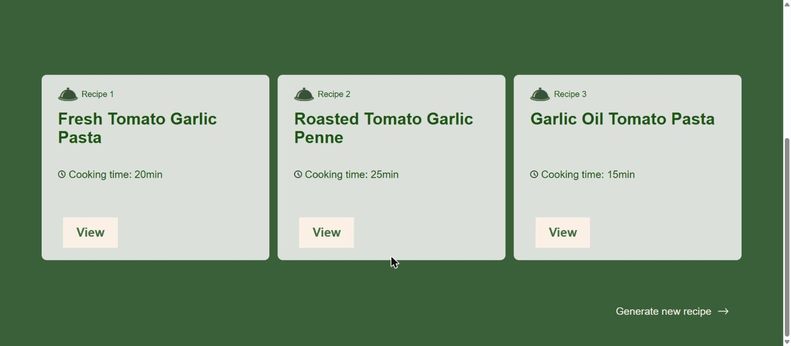
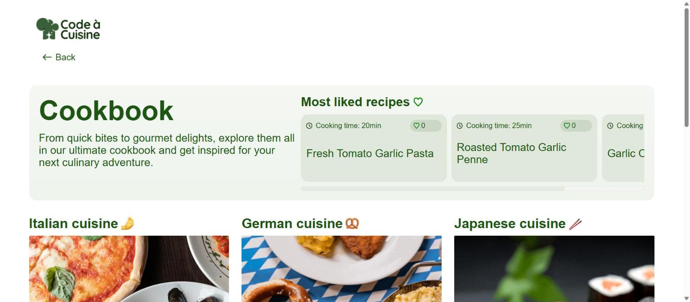
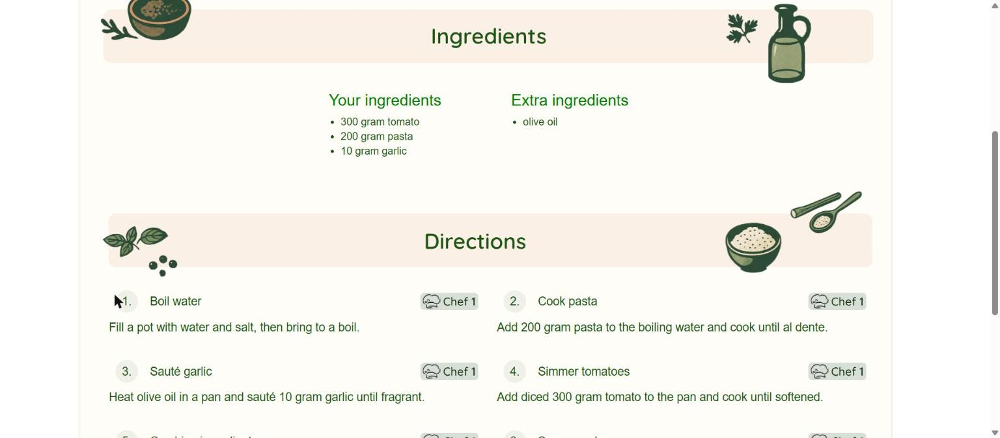
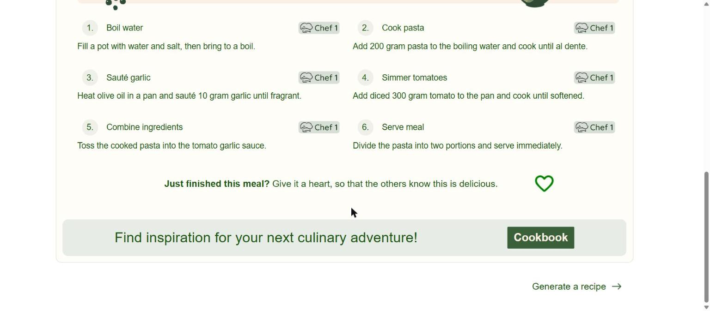
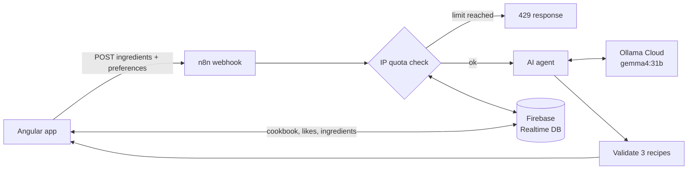

<div align="center">

# Code à Cuisine

**AI-powered recipe generator.** Enter what's in your kitchen, pick your preferences, and get three recipes cooked up by an AI agent.




</div>

## Features

- **Ingredients in, recipes out.** Add at least three ingredients with quantity and unit, and the AI builds three matching recipes around them.
- **Preferences.** Portions, number of cooks, cooking time (quick / medium / complex), cuisine (German, Italian, Indian, Japanese, Gourmet, Fusion) and diets (vegetarian, vegan, keto).
- **Step-by-step directions.** Each recipe splits your ingredients from the extras it needs and assigns steps to the cooks.
- **Cookbook.** Every generated recipe is saved. Browse by cuisine, see the most liked recipes and give your favourites a heart.
- **Fair use limit.** 3 generations per IP and 12 in total per 24 hours, enforced in the workflow and stored in Firebase.
- **Responsive.** Built for desktop and mobile.

## Screenshots

| Add ingredients | Choose preferences |
| :---: | :---: |
|  |  |
| **Your three recipes** | **Cookbook** |
|  |  |
| **Ingredients** | **Directions** |
|  |  |


## How it works



1. The app sends the ingredient list and preferences to the n8n webhook `code-a-cuisine-recipe`.
2. The workflow reads the caller IP from the proxy headers and checks the rolling 24h quota in Firebase.
3. An AI agent with a structured output parser asks the model for exactly three recipes as JSON.
4. The result is validated (falls back to simple recipes if the model output is unusable) and returned to the app.
5. The app stores the recipes in Firebase so they show up in the cookbook.

## Tech stack

| Layer | Technology |
| --- | --- |
| Frontend | Angular 22 (standalone components, signals), SCSS |
| Backend | n8n Cloud workflow (`n8n/code-a-cuisine-recipe-agent.json`) |
| AI | Ollama Cloud, `gemma4:31b`, via the OpenAI-compatible API |
| Database | Firebase Realtime Database (`database.rules.json`) |

## Getting started

```bash
git clone https://github.com/alexlindt-arch/code-a-cuisine.git
cd code-a-cuisine
npm install
npm start
```

The app runs on `http://localhost:4200`.

### Configuration

Both endpoints live in `src/environments/environment.ts` and `environment.prod.ts`:

```ts
const n8nBaseUrl = 'https://<your-name>.app.n8n.cloud/';

export const environment = {
  production: true,
  n8nBaseUrl,
  recipeWebhookUrl: `${n8nBaseUrl}webhook/`,
  firebaseDatabaseUrl: 'https://<your-project>-default-rtdb.<region>.firebasedatabase.app',
};
```

### Backend setup

- **n8n:** import the workflow, connect the model and activate it. See [`n8n/README.md`](n8n/README.md).
- **Firebase:** create a Realtime Database and deploy the rules with `firebase deploy --only database`. Also set the database URL in the *Check IP Quota* node of the workflow.

## Project structure

```
src/app/
├── hero/               start page
├── generate-recipe/    ingredient input
├── preferences/        preferences, quota handling, webhook request
├── results/            the three generated recipes
├── recipe-detail/      ingredients and directions
├── cookbook/           saved recipes, most liked
├── cookbook-category/  recipes per cuisine
└── impress/            imprint
n8n/                    workflow export and setup guide
docs/screenshots/       README images
```

## Author

**Alexander Lindt**: [GitHub](https://github.com/alexlindt-arch)
